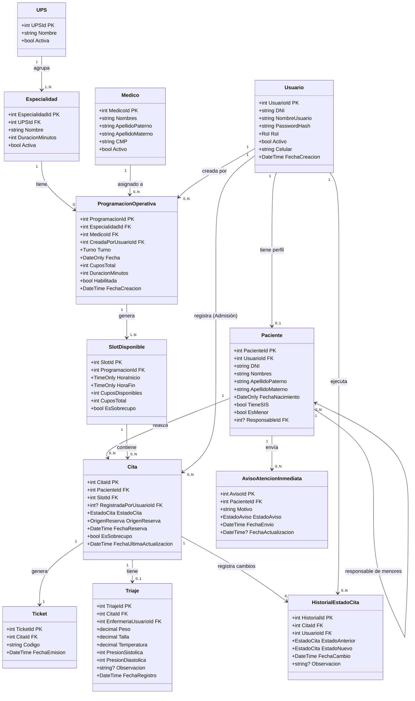

# MODELO DE DOMINIO

Proyecto: Sistema Web de Gestión de Citas Médicas – Posta de Salud (PostaCitasWeb)  
Versión: 1.0  
Arquitectura: MVC – ASP.NET Core / Entity Framework Core / SQL Server

---

## 1. ENTIDADES PRINCIPALES

Las entidades se derivan exclusivamente de las reglas de negocio (RN), requisitos funcionales (RF) y casos de uso (CU) documentados. No se incluye ninguna funcionalidad fuera del alcance definido.

---

### 1.1 Usuario

Entidad central de autenticación. Representa a cualquier actor del sistema con credenciales de acceso (RN01, RF01, RF02).

| Atributo | Tipo C# | Restricción |
|---|---|---|
| `UsuarioId` | `int` | PK, Identity |
| `DNI` | `string` (8) | Único, requerido |
| `NombreUsuario` | `string` (50) | Único, requerido |
| `PasswordHash` | `string` | Requerido |
| `Rol` | `enum Rol` | Requerido |
| `Activo` | `bool` | Default: false (RN01) |
| `FechaCreacion` | `DateTime` | Requerido |
| `Celular` | `string` (15) | Requerido para recuperación (RN02-A) |

**Enum Rol:** `Paciente`, `Admision`, `Enfermeria`, `Administrador`

**Propiedades de navegación:**
```csharp
public Paciente? Paciente { get; set; }         // navegación 1:1
```

---

### 1.2 Paciente

Representa a la persona que solicita atención médica. Puede ser un adulto o un menor gestionado por un responsable (RF04, RN03, RF05, RF06).

| Atributo | Tipo C# | Restricción |
|---|---|---|
| `PacienteId` | `int` | PK, Identity |
| `UsuarioId` | `int` | FK → Usuario, único |
| `DNI` | `string` (8) | No modificable (RN02) |
| `Nombres` | `string` (100) | No modificable (RN02) |
| `ApellidoPaterno` | `string` (50) | No modificable |
| `ApellidoMaterno` | `string` (50) | No modificable |
| `FechaNacimiento` | `DateOnly` | No modificable (RN02) |
| `TieneSIS` | `bool` | RF05 |
| `PostaAsociadaId` | `int?` | FK → Posta (referencial) |
| `EsMenor` | `bool` | Calculado: FechaNacimiento |
| `ResponsableId` | `int?` | FK → Paciente (self-ref, RN03) |

**Propiedades de navegación:**
```csharp
public Usuario Usuario { get; set; }
public Paciente? Responsable { get; set; }
public ICollection<Paciente> Dependientes { get; set; }
public ICollection<Cita> Citas { get; set; }
```

---

### 1.3 Especialidad

Representa una especialidad médica visible para el paciente (RF07, RF14, RN07).

| Atributo | Tipo C# | Restricción |
|---|---|---|
| `EspecialidadId` | `int` | PK, Identity |
| `Nombre` | `string` (100) | Requerido |
| `UPSId` | `int` | FK → UPS |
| `DuracionMinutos` | `int` | Requerido (RF23, RN29) |
| `Activa` | `bool` | Default: true |

**Propiedades de navegación:**
```csharp
public UPS UPS { get; set; }
public ICollection<ProgramacionOperativa> Programaciones { get; set; }
```

---

### 1.4 UPS (Unidad Prestadora de Servicios)

Unidad organizativa interna. No visible para pacientes (RN07, RF13).

| Atributo | Tipo C# | Restricción |
|---|---|---|
| `UPSId` | `int` | PK, Identity |
| `Nombre` | `string` (100) | Requerido |
| `Activa` | `bool` | Default: true |

**Propiedades de navegación:**
```csharp
public ICollection<Especialidad> Especialidades { get; set; }
```

---

### 1.5 Medico

Personal médico asociado a programaciones. No es un actor de autenticación en el sistema (RF15A).

| Atributo | Tipo C# | Restricción |
|---|---|---|
| `MedicoId` | `int` | PK, Identity |
| `Nombres` | `string` (100) | Requerido |
| `ApellidoPaterno` | `string` (50) | Requerido |
| `ApellidoMaterno` | `string` (50) | |
| `CMP` | `string` (20) | Único |
| `Activo` | `bool` | Default: true |

**Propiedades de navegación:**
```csharp
public ICollection<ProgramacionOperativa> Programaciones { get; set; }
```

---

### 1.6 ProgramacionOperativa

Configura la plantilla de disponibilidad futura definida por el Administrador (RF15A, RN17, CU10). Admisión no puede crear esta entidad, solo habilitarla (RN06).

| Atributo | Tipo C# | Restricción |
|---|---|---|
| `ProgramacionId` | `int` | PK, Identity |
| `EspecialidadId` | `int` | FK → Especialidad |
| `MedicoId` | `int` | FK → Medico |
| `Turno` | `enum Turno` | Mañana / Tarde (RN27) |
| `Fecha` | `DateOnly` | Requerido |
| `CuposTotal` | `int` | Requerido |
| `DuracionMinutos` | `int` | Heredado de Especialidad (RN29) |
| `Habilitada` | `bool` | Default: false (RF15) |
| `FechaCreacion` | `DateTime` | Auditoría (RN32) |
| `CreadaPorUsuarioId` | `int` | FK → Usuario |

**Enum Turno:** `Manana`, `Tarde`

**Propiedades de navegación:**
```csharp
public Especialidad Especialidad { get; set; }
public Medico Medico { get; set; }
public Usuario CreadaPorUsuario { get; set; }
public ICollection<SlotDisponible> Slots { get; set; }
```

---

### 1.7 SlotDisponible

Representa un cupo horario individual generado a partir de una ProgramacionOperativa (RN08, RF08, RF09, CU11). Es la unidad mínima de reserva.

| Atributo | Tipo C# | Restricción |
|---|---|---|
| `SlotId` | `int` | PK, Identity |
| `ProgramacionId` | `int` | FK → ProgramacionOperativa |
| `HoraInicio` | `TimeOnly` | Calculado según turno y duración |
| `HoraFin` | `TimeOnly` | Calculado |
| `CuposDisponibles` | `int` | Decrementado por reservas (RN04) |
| `CuposTotal` | `int` | Fijo en creación |
| `EsSobrecupo` | `bool` | Default: false (RN15, RN16) |

**Propiedades de navegación:**
```csharp
public ProgramacionOperativa Programacion { get; set; }
public ICollection<Cita> Citas { get; set; }
```

---

### 1.8 Cita

Entidad central del dominio. Representa la reserva de un paciente en un slot horario. Puede originarse desde web o presencialmente (RN04, RF09, RF10, RN11, RN31).

| Atributo | Tipo C# | Restricción |
|---|---|---|
| `CitaId` | `int` | PK, Identity |
| `PacienteId` | `int` | FK → Paciente |
| `SlotId` | `int` | FK → SlotDisponible |
| `EstadoCita` | `enum EstadoCita` | Ver estados (RN21) |
| `OrigenReserva` | `enum OrigenReserva` | Web / Presencial (RN04) |
| `FechaReserva` | `DateTime` | Automático al confirmar |
| `EsSobrecupo` | `bool` | Default: false (RN15, RN16) |
| `RegistradaPorUsuarioId` | `int?` | FK → Usuario (Admisión en presencial) |
| `FechaUltimaActualizacion` | `DateTime` | Trazabilidad (RN30) |

**Enum EstadoCita:** `Pendiente`, `EnTriaje`, `ListoAtencion`, `NoAsistio`, `Cancelada`

**Enum OrigenReserva:** `Web`, `Presencial`

**Propiedades de navegación:**
```csharp
public Paciente Paciente { get; set; }
public SlotDisponible Slot { get; set; }
public Usuario? RegistradaPorUsuario { get; set; }
public Ticket? Ticket { get; set; }
public Triaje? Triaje { get; set; }
public ICollection<HistorialEstadoCita> Historial { get; set; }
```

---

### 1.9 Ticket

Comprobante generado automáticamente al confirmar una reserva (RF12, RN12, CU09).

| Atributo | Tipo C# | Restricción |
|---|---|---|
| `TicketId` | `int` | PK, Identity |
| `CitaId` | `int` | FK → Cita, único |
| `Codigo` | `string` (20) | Único, generado |
| `FechaEmision` | `DateTime` | Automático |

**Propiedades de navegación:**
```csharp
public Cita Cita { get; set; }
```

---

### 1.10 Triaje

Evaluación inicial del paciente registrada exclusivamente por Enfermería antes de la atención (RF17, RN19, RN20, RN22).

| Atributo | Tipo C# | Restricción |
|---|---|---|
| `TriajeId` | `int` | PK, Identity |
| `CitaId` | `int` | FK → Cita, único |
| `Peso` | `decimal` | kg |
| `Talla` | `decimal` | cm |
| `Temperatura` | `decimal` | °C |
| `PresionSistolica` | `int` | mmHg |
| `PresionDiastolica` | `int` | mmHg |
| `Observacion` | `string?` (500) | Opcional |
| `FechaRegistro` | `DateTime` | Automático |
| `EnfermeriaUsuarioId` | `int` | FK → Usuario (solo Enfermería) |

**Propiedades de navegación:**
```csharp
public Cita Cita { get; set; }
public Usuario EnfermeriaUsuario { get; set; }
```

---

### 1.11 HistorialEstadoCita

Tabla de auditoría de todos los cambios de estado de una cita. Garantiza la trazabilidad exigida por RN30 y RN32.

| Atributo | Tipo C# | Restricción |
|---|---|---|
| `HistorialId` | `int` | PK, Identity |
| `CitaId` | `int` | FK → Cita |
| `EstadoAnterior` | `enum EstadoCita` | |
| `EstadoNuevo` | `enum EstadoCita` | |
| `FechaCambio` | `DateTime` | Automático |
| `UsuarioId` | `int` | FK → Usuario (quién cambió) |
| `Observacion` | `string?` | Motivo del cambio |

**Propiedades de navegación:**
```csharp
public Cita Cita { get; set; }
public Usuario Usuario { get; set; }
```

---

### 1.12 AvisoAtencionInmediata

Aviso informativo enviado por el paciente a Enfermería. No genera cita ni altera el orden de atención (RF20, RF21, RN24, RN25, RN26).

| Atributo | Tipo C# | Restricción |
|---|---|---|
| `AvisoId` | `int` | PK, Identity |
| `PacienteId` | `int` | FK → Paciente |
| `Motivo` | `string` (300) | Requerido |
| `EstadoAviso` | `enum EstadoAviso` | |
| `FechaEnvio` | `DateTime` | Automático |
| `FechaActualizacion` | `DateTime?` | Al cambiar estado |

**Enum EstadoAviso:** `Pendiente`, `Visualizado`, `Cerrado`

**Propiedades de navegación:**
```csharp
public Paciente Paciente { get; set; }
```

---

## 2. RELACIONES Y CARDINALIDAD

| Entidad A | Cardinalidad | Entidad B | Descripción |
|---|---|---|---|
| Usuario | 1:1 | Paciente | Un usuario puede tener un perfil Paciente |
| Paciente | 1:N | Paciente | Un responsable gestiona N menores (self-ref, RN03) |
| UPS | 1:N | Especialidad | Una UPS agrupa N especialidades |
| Especialidad | 1:N | ProgramacionOperativa | Una especialidad aparece en N programaciones |
| Medico | 1:N | ProgramacionOperativa | Un médico tiene N programaciones |
| ProgramacionOperativa | 1:N | SlotDisponible | Una programación genera N slots (RN08) |
| SlotDisponible | 1:N | Cita | Un slot puede tener N citas (cupos, RN04) |
| Paciente | 1:N | Cita | Un paciente tiene N citas (RN31: no duplicados activos en mismo slot) |
| Cita | 1:1 | Ticket | Toda cita confirmada genera un ticket (RN12) |
| Cita | 1:1 | Triaje | Una cita tiene a lo sumo un triaje (RN19) |
| Cita | 1:N | HistorialEstadoCita | Cada cambio de estado queda registrado (RN30) |
| Paciente | 1:N | AvisoAtencionInmediata | Un paciente puede enviar N avisos |

---

## 3. DIAGRAMA DE CLASES (MERMAID)



---

## 4. ENUMERACIONES DEL DOMINIO

### Rol
```csharp
public enum Rol
{
    Paciente,
    Admision,
    Enfermeria,
    Administrador
}
```

### Turno
```csharp
public enum Turno
{
    Manana,   // 08:00 – 13:30 (RN28)
    Tarde     // 15:00 – 19:00 (RN28)
}
```

### EstadoCita
```csharp
public enum EstadoCita
{
    Pendiente,
    EnTriaje,
    ListoAtencion,
    NoAsistio,
    Cancelada
}
```

### OrigenReserva
```csharp
public enum OrigenReserva
{
    Web,
    Presencial
}
```

### EstadoAviso
```csharp
public enum EstadoAviso
{
    Pendiente,
    Visualizado,
    Cerrado
}
```

---

## 5. RESTRICCIONES DE DOMINIO DERIVADAS DE LAS REGLAS DE NEGOCIO

### Acceso y cuenta
- El campo `Activo` de `Usuario` se inicializa en `false`. Solo Admisión lo habilita (RN01).
- Los campos `DNI`, `Nombres` y `FechaNacimiento` de `Paciente` no pueden actualizarse por el sistema una vez creados (RN02). Esto se aplica a nivel de servicio de aplicación, no solo de base de datos.
- La recuperación de contraseña requiere validar `DNI` y `Celular` coincidentes en la misma entidad `Usuario` (RN02-A).

### Disponibilidad y cupos
- `SlotDisponible.CuposDisponibles` nunca puede ser negativo. Su decremento ocurre al confirmar una `Cita` y su incremento al cancelarla (RN04, RN14).
- Solo `ProgramacionOperativa` con `Habilitada = true` expone slots a los pacientes (RN05).
- Admisión no puede insertar `ProgramacionOperativa`. Solo puede establecer `Habilitada = true` sobre registros existentes (RN06).
- Los slots con `EsSobrecupo = true` no se devuelven en las consultas de disponibilidad para el rol `Paciente` (RN16).
- Las modificaciones de programación solo pueden afectar fechas futuras a la fecha actual del servidor (RN09, RN18).

### Reservas
- No puede existir más de una `Cita` en estado `Pendiente`, `EnTriaje` o `ListoAtencion` para el mismo `PacienteId` y `SlotId` simultáneamente (RN31). Se recomienda un índice único condicional en SQL Server o validación en la capa de servicio.
- Toda `Cita` confirmada debe disparar la creación de un `Ticket`. Ambas operaciones deben ejecutarse en la misma transacción de base de datos (RN12).
- Una `Cita` solo puede cancelarse si `EstadoCita = Pendiente` y si el momento actual es anterior al inicio del periodo de triaje del turno correspondiente (RN13, RN36):
  - Turno `Manana`: cancelación posible antes de las 07:40.
  - Turno `Tarde`: cancelación posible antes de las 14:40.

### Triaje
- Solo un usuario con `Rol = Enfermeria` puede insertar un `Triaje` (RN20).
- Al registrar un `Triaje`, el `EstadoCita` de la `Cita` asociada debe cambiar automáticamente a `EnTriaje`, registrando el cambio en `HistorialEstadoCita` (RN19, RN30).
- Los datos del triaje son operativos y no constituyen historia clínica (RN23, RN34).

### Trazabilidad y auditoría
- Cada cambio de `EstadoCita` debe generar un registro en `HistorialEstadoCita` con el usuario que lo realizó (RN30, RN32).
- Las acciones administrativas sobre `ProgramacionOperativa` y `Usuario` quedan auditadas mediante los campos `FechaCreacion` y `CreadaPorUsuarioId` (RN32).

### Avisos de atención inmediata
- Un `AvisoAtencionInmediata` no produce ninguna `Cita` ni modifica disponibilidad (RN24).
- No afecta el orden de atención (RN25).
- Solo es visible para usuarios con `Rol = Enfermeria` (RN26).

---

## 6. NOTAS DE IMPLEMENTACIÓN EN EF CORE

- Configurar `DeleteBehavior.Restrict` en todas las FK hacia `Cita` y `Paciente` para evitar eliminaciones en cascada no controladas.
- Usar `HasQueryFilter` en `SlotDisponible` para filtrar `EsSobrecupo = false` de forma global cuando el contexto sea de paciente.
- Aplicar `OwnsOne` o tabla separada para `Triaje` si se opta por modelado de Value Objects en una refactorización futura.
- El cálculo automático de `SlotDisponible` (generación de horarios a partir de `HoraInicio` del turno + `DuracionMinutos`) debe realizarse en la capa de servicio, no en la base de datos, para mantener la lógica de negocio centralizada (RN08, RN27, RN28, RN29).
- Configurar índice único en `Ticket.CitaId` y en `Triaje.CitaId` para reforzar las relaciones 1:1 en base de datos.

---

*Documento generado en base a: 00_constitucion.md, 01_requisitos.md, 02_casos_uso.md, 03_reglas_negocio.md — Versión 1.0*