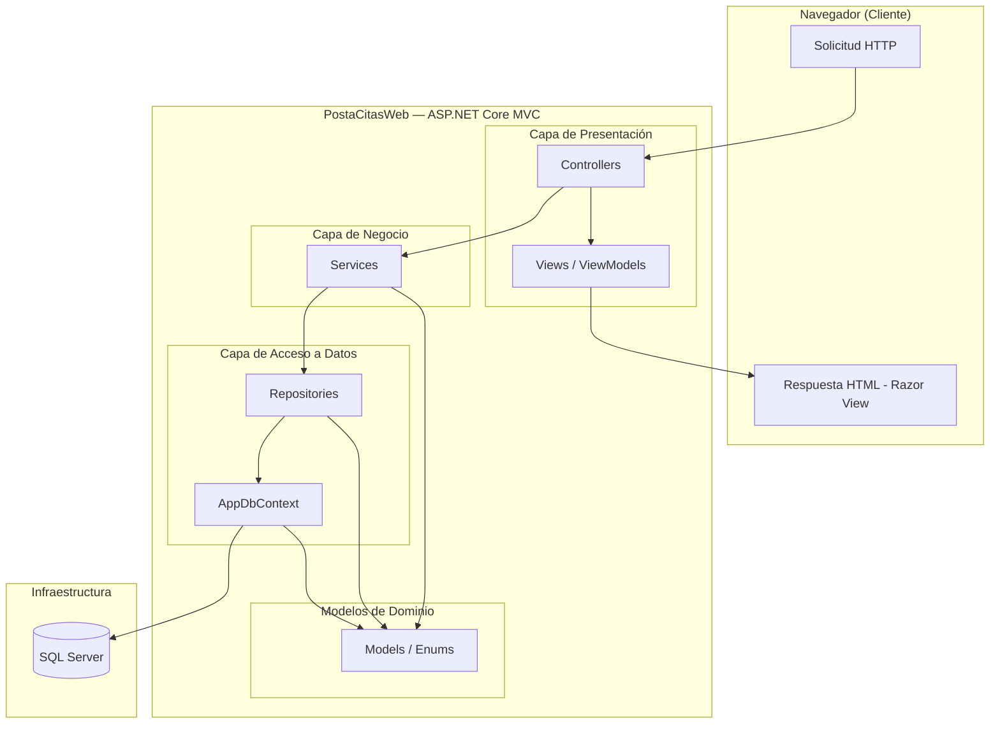

# ARQUITECTURA DEL SISTEMA

Proyecto: Sistema Web de Gestión de Citas Médicas – Posta de Salud (PostaCitasWeb)  
Versión: 1.0  
Patrón: MVC (Model-View-Controller)  
Stack: ASP.NET Core · Entity Framework Core 10 · SQL Server

---

## 1. VISIÓN GENERAL

PostaCitasWeb sigue el patrón **MVC de tres capas** implementado dentro de un único proyecto ASP.NET Core. La separación de responsabilidades se logra mediante carpetas con convención estricta, no mediante proyectos separados, lo cual es coherente con el alcance MVP definido en la constitución del proyecto.

```
Solicitud HTTP
      │
      ▼
 [ Controllers ]        ← Recibe, delega, devuelve vista o redirecciona
      │
      ▼
 [ Services ]           ← Orquesta lógica de negocio y reglas de dominio
      │
      ▼
 [ Repositories ]       ← Acceso a datos (abstracción sobre EF Core)
      │
      ▼
 [ Models / DbContext ]  ← Entidades EF Core + SQL Server
      │
      ▼
 [ Views ]              ← Razor (.cshtml) renderizadas al cliente
```

---

## 2. ESTRUCTURA DE CARPETAS DEL PROYECTO

Mapeada directamente sobre lo visible en Visual Studio:

```
PostaCitasWeb/
│
├── Controllers/                  ← Capa de presentación / entrada HTTP
│   ├── AuthController.cs
│   ├── CitasController.cs
│   ├── DisponibilidadController.cs
│   ├── PacientesController.cs
│   ├── TriajeController.cs
│   ├── AvisosController.cs
│   └── AdminController.cs
│
├── Models/                       ← Entidades de dominio (EF Core)
│   ├── Usuario.cs
│   ├── Paciente.cs
│   ├── Especialidad.cs
│   ├── UPS.cs
│   ├── Medico.cs
│   ├── ProgramacionOperativa.cs
│   ├── SlotDisponible.cs
│   ├── Cita.cs
│   ├── Ticket.cs
│   ├── Triaje.cs
│   ├── HistorialEstadoCita.cs
│   ├── AvisoAtencionInmediata.cs
│   └── Enums/
│       ├── Rol.cs
│       ├── Turno.cs
│       ├── EstadoCita.cs
│       ├── OrigenReserva.cs
│       └── EstadoAviso.cs
│
├── Data/                         ← DbContext y configuraciones EF Core
│   ├── AppDbContext.cs
│   └── Configurations/           ← IEntityTypeConfiguration<T> por entidad
│       ├── UsuarioConfiguration.cs
│       ├── PacienteConfiguration.cs
│       ├── CitaConfiguration.cs
│       └── ...
│
├── Repositories/                 ← Abstracción de acceso a datos
│   ├── Interfaces/
│   │   ├── ICitaRepository.cs
│   │   ├── ISlotRepository.cs
│   │   ├── IPacienteRepository.cs
│   │   └── ...
│   └── Implementations/
│       ├── CitaRepository.cs
│       ├── SlotRepository.cs
│       ├── PacienteRepository.cs
│       └── ...
│
├── Services/                     ← Lógica de negocio y reglas de dominio
│   ├── Interfaces/
│   │   ├── ICitaService.cs
│   │   ├── IDisponibilidadService.cs
│   │   ├── ITriajeService.cs
│   │   ├── IAuthService.cs
│   │   └── ...
│   └── Implementations/
│       ├── CitaService.cs
│       ├── DisponibilidadService.cs
│       ├── TriajeService.cs
│       ├── AuthService.cs
│       └── ...
│
├── Views/                        ← Razor Views por controlador
│   ├── Auth/
│   ├── Citas/
│   ├── Disponibilidad/
│   ├── Pacientes/
│   ├── Triaje/
│   ├── Avisos/
│   ├── Admin/
│   └── Shared/
│       ├── _Layout.cshtml
│       └── _ValidationScriptsPartial.cshtml
│
├── wwwroot/                      ← Archivos estáticos
│   ├── css/
│   ├── js/
│   └── lib/
│
├── docs/                         ← Documentación SDD del proyecto
│   ├── 00_constitucion.md
│   ├── 01_requisitos.md
│   ├── 02_casos_uso.md
│   ├── 03_reglas_negocio.md
│   ├── 04_modelo_dominio.md
│   ├── 05_arquitectura.md        ← Este documento
│   ├── 06_base_datos.md
│   ├── 07_pruebas.md
│   └── 08_mapeo_mvc.md
│
├── Program.cs                    ← Punto de entrada, DI container, middleware
└── appsettings.json              ← Cadena de conexión, configuración
```

---

## 3. CAPAS Y RESPONSABILIDADES

### 3.1 Controllers

**Responsabilidad:** Recibir la solicitud HTTP, invocar el servicio correspondiente y devolver una vista Razor o redireccionar. No contienen lógica de negocio.

**Convención de nombres:** Un controlador por módulo funcional definido en `00_constitucion.md`.

| Controlador | Módulo | Actores principales |
|---|---|---|
| `AuthController` | M01 Autenticación | Todos |
| `PacientesController` | M02 Gestión de Pacientes | Paciente, Responsable |
| `CitasController` | M03 Gestión de Citas | Paciente, Admisión |
| `DisponibilidadController` | M04 Disponibilidad | Admisión, Administrador |
| `TriajeController` | M05 Triaje | Enfermería |
| `AvisosController` | M08 Aviso de Atención | Paciente, Enfermería |
| `AdminController` | M06 Administración | Administrador |

**Regla de autorización:** Cada action method decorado con `[Authorize(Roles = "...")]` según el actor definido en los casos de uso.

---

### 3.2 Services

**Responsabilidad:** Orquestar la lógica de negocio y aplicar las reglas de dominio documentadas en `03_reglas_negocio.md`. Es la única capa que conoce las reglas de negocio.

**Principio:** Un servicio no accede directamente a `AppDbContext`. Siempre lo hace a través de un repositorio.

Ejemplos de responsabilidades por servicio:

**`CitaService`**
- Verificar disponibilidad de cupos antes de confirmar (RN10).
- Decrementar `SlotDisponible.CuposDisponibles` en la misma transacción que crea la `Cita` (RN04).
- Crear el `Ticket` asociado en la misma transacción (RN12).
- Validar que no exista duplicidad de reservas activas (RN31).
- Validar ventana de cancelación según turno y hora actual (RN13, RN36).
- Registrar entrada en `HistorialEstadoCita` en cada cambio de estado (RN30).

**`DisponibilidadService`**
- Generar `SlotDisponible` a partir de `ProgramacionOperativa` según duración y turno (RN08, RN27, RN28, RN29).
- Filtrar slots con `EsSobrecupo = true` cuando el solicitante es `Paciente` (RN16).
- Rechazar modificaciones sobre jornadas ya iniciadas (RN09).

**`AuthService`**
- Controlar que `Usuario.Activo = false` hasta habilitación por Admisión (RN01).
- Validar `DNI` + `Celular` en recuperación de contraseña (RN02-A).

**`TriajeService`**
- Verificar que el usuario sea `Rol = Enfermeria` antes de registrar triaje (RN20).
- Cambiar `EstadoCita` a `EnTriaje` al registrar triaje y a `ListoAtencion` al finalizar (RN21).

---

### 3.3 Repositories

**Responsabilidad:** Abstraer las consultas a la base de datos mediante EF Core. Cada repositorio expone operaciones sobre una entidad raíz.

**Patrón:** Interfaz + implementación concreta, registrados en DI como `Scoped`.

```csharp
// Ejemplo de interfaz
public interface ICitaRepository
{
    Task<Cita?> GetByIdAsync(int citaId);
    Task<IEnumerable<Cita>> GetByPacienteAsync(int pacienteId);
    Task AddAsync(Cita cita);
    Task UpdateAsync(Cita cita);
    Task SaveChangesAsync();
}
```

No se implementa el patrón Unit of Work explícito; `AppDbContext` actúa como Unit of Work implícito de EF Core. Las transacciones complejas (por ejemplo, crear Cita + descontar cupo + crear Ticket) se gestionan en la capa de servicio mediante `DbContext.Database.BeginTransactionAsync()`.

---

### 3.4 Models (Entidades de Dominio)

**Responsabilidad:** Representar el esquema de base de datos mediante clases POCO mapeadas por EF Core. Las entidades no contienen lógica de negocio; esta reside en los servicios.

Las entidades están definidas íntegramente en `04_modelo_dominio.md`. La carpeta `Models/Enums/` centraliza todos los enumerados del dominio para evitar duplicaciones.

---

### 3.5 Data / AppDbContext

**Responsabilidad:** Punto único de acceso a la base de datos. Registra todas las entidades y aplica las configuraciones Fluent API mediante clases `IEntityTypeConfiguration<T>` en la subcarpeta `Configurations/`.

```csharp
public class AppDbContext : DbContext
{
    public DbSet<Usuario> Usuarios { get; set; }
    public DbSet<Paciente> Pacientes { get; set; }
    public DbSet<Especialidad> Especialidades { get; set; }
    public DbSet<UPS> UPS { get; set; }
    public DbSet<Medico> Medicos { get; set; }
    public DbSet<ProgramacionOperativa> Programaciones { get; set; }
    public DbSet<SlotDisponible> Slots { get; set; }
    public DbSet<Cita> Citas { get; set; }
    public DbSet<Ticket> Tickets { get; set; }
    public DbSet<Triaje> Triajes { get; set; }
    public DbSet<HistorialEstadoCita> HistorialEstados { get; set; }
    public DbSet<AvisoAtencionInmediata> Avisos { get; set; }

    protected override void OnModelCreating(ModelBuilder modelBuilder)
    {
        modelBuilder.ApplyConfigurationsFromAssembly(typeof(AppDbContext).Assembly);
    }
}
```

---

### 3.6 Views (Razor)

**Responsabilidad:** Renderizar la interfaz de usuario. Reciben datos desde el controlador a través de `ViewModel` fuertemente tipados, nunca entidades de dominio directamente.

**Convención de ViewModels:** Para cada vista compleja se define un ViewModel en una subcarpeta `ViewModels/` (no expuesta en la imagen pero necesaria):

```
ViewModels/
├── Citas/
│   ├── ReservaCitaViewModel.cs
│   ├── DetalleCitaViewModel.cs
│   └── DisponibilidadViewModel.cs
├── Triaje/
│   └── RegistroTriajeViewModel.cs
├── Auth/
│   ├── LoginViewModel.cs
│   └── RecuperarAccesoViewModel.cs
└── ...
```

**Regla:** Las entidades `Models/` no se pasan directamente a la vista. Siempre se usa un ViewModel o un tipo anónimo para proyecciones simples.

---

## 4. FLUJO DE DATOS — CASO PRINCIPAL (Reservar Cita)

Trazado sobre el flujo definido en CU06 y RN11:

```
[Paciente en navegador]
        │  GET /Citas/Disponibilidad?especialidadId=2&turno=Manana
        ▼
[CitasController.Disponibilidad()]
        │  Llama a IDisponibilidadService.ObtenerSlotsAsync(especialidadId, turno, fecha)
        ▼
[DisponibilidadService]
        │  Aplica filtro EsSobrecupo=false para Paciente (RN16)
        │  Llama a ISlotRepository.GetDisponiblesAsync(...)
        ▼
[SlotRepository → AppDbContext → SQL Server]
        │  Devuelve List<SlotDisponible>
        ▼
[DisponibilidadService]
        │  Proyecta a DisponibilidadViewModel
        ▼
[CitasController]
        │  return View(viewModel)
        ▼
[Views/Citas/Disponibilidad.cshtml]
        │  Muestra tarjetas de horario disponible
        ▼
[Paciente selecciona slot]
        │  POST /Citas/Confirmar  { slotId, pacienteId }
        ▼
[CitasController.Confirmar()]
        │  Llama a ICitaService.ReservarAsync(slotId, pacienteId)
        ▼
[CitaService]
        │  Inicia transacción
        │  Verifica cupos (RN10)
        │  Verifica no duplicidad (RN31)
        │  Crea Cita { EstadoCita = Pendiente, OrigenReserva = Web }
        │  Decrementa SlotDisponible.CuposDisponibles (RN04)
        │  Crea Ticket (RN12)
        │  Registra HistorialEstadoCita (RN30)
        │  Commit transacción
        ▼
[CitasController]
        │  RedirectToAction("Ticket", new { ticketId })
        ▼
[Views/Citas/Ticket.cshtml]
        │  Muestra comprobante con código, especialidad, médico, hora, fecha
```

---

## 5. CONFIGURACIÓN DEL CONTENEDOR DE DEPENDENCIAS (Program.cs)

```csharp
// Program.cs — Registro de servicios

// DbContext
builder.Services.AddDbContext<AppDbContext>(options =>
    options.UseSqlServer(builder.Configuration.GetConnectionString("DefaultConnection")));

// Autenticación por Cookies
builder.Services.AddAuthentication(CookieAuthenticationDefaults.AuthenticationScheme)
    .AddCookie(options =>
    {
        options.LoginPath = "/Auth/Login";
        options.AccessDeniedPath = "/Auth/Denegado";
    });

// Repositorios (Scoped — ciclo de vida por solicitud HTTP)
builder.Services.AddScoped<ICitaRepository, CitaRepository>();
builder.Services.AddScoped<ISlotRepository, SlotRepository>();
builder.Services.AddScoped<IPacienteRepository, PacienteRepository>();
builder.Services.AddScoped<IUsuarioRepository, UsuarioRepository>();
// ... resto de repositorios

// Servicios (Scoped)
builder.Services.AddScoped<ICitaService, CitaService>();
builder.Services.AddScoped<IDisponibilidadService, DisponibilidadService>();
builder.Services.AddScoped<IAuthService, AuthService>();
builder.Services.AddScoped<ITriajeService, TriajeService>();
// ... resto de servicios

builder.Services.AddControllersWithViews();
```

---

## 6. AUTENTICACIÓN Y CONTROL DE ACCESO

**Mecanismo:** Cookie Authentication de ASP.NET Core (sin JWT, coherente con arquitectura MVC server-side renderizada).

**Flujo de autenticación:**
1. El usuario envía credenciales vía `POST /Auth/Login`.
2. `AuthService` valida `NombreUsuario` + `PasswordHash` y verifica `Activo = true` (RN01).
3. Se genera un `ClaimsPrincipal` con los claims: `UsuarioId`, `DNI`, `Rol`, `PacienteId` (si aplica).
4. ASP.NET Core emite la cookie cifrada de sesión.
5. Si el login es exitoso en `/Auth/Login`, el sistema evalúa el claim `ClaimTypes.Role` y redirige automáticamente al dashboard principal correspondiente al rol autenticado.
6. Cada controlador y action method aplica `[Authorize(Roles = "...")]` según corresponda al caso de uso.

**Rutas de redirección post-login por rol:**
- `Paciente` y `Responsable` → `/Paciente/Index`
- `Admision` → `/Admision/Index`
- `Enfermeria` → `/Enfermeria/Index`
- `Administrador` → `/Admin/Index`

**Observación de trazabilidad y routing:**
El rol `Medico` no dispone de dashboard standalone en la política de rutas vigente. Por ello, no se define una ruta `/Medico/Index` como destino post-login.

**Tabla de acceso por rol:**

| Ruta | Paciente | Responsable | Admisión | Enfermería | Médico | Administrador |
|---|:---:|:---:|:---:|:---:|:---:|:---:|
| `/Auth/*` | ✔ | ✔ | ✔ | ✔ | ✔ | ✔ |
| `/Paciente/Index` | ✔ | ✔ | — | — | — | — |
| `/Admision/Index` | — | — | ✔ | — | — | — |
| `/Enfermeria/Index` | — | — | — | ✔ | — | — |
| `/Admin/Index` | — | — | — | — | — | ✔ |
| `/Citas/Disponibilidad` | ✔ | ✔ | ✔ | — | — | — |
| `/Citas/Reservar` | ✔ | ✔ | — | — | — | — |
| `/Citas/Presencial` | — | — | ✔ | — | — | — |
| `/Disponibilidad/Habilitar` | — | — | ✔ | — | — | — |
| `/Disponibilidad/Configurar` | — | — | — | — | — | ✔ |
| `/Triaje/*` | — | — | — | ✔ | — | — |
| `/Avisos/Enviar` | ✔ | ✔ | — | — | — | — |
| `/Avisos/Panel` | — | — | — | ✔ | — | — |
| `/Admin/*` | — | — | — | — | — | ✔ |

---

## 7. DECISIONES ARQUITECTÓNICAS

| Decisión | Justificación |
|---|---|
| Un solo proyecto ASP.NET Core | Coherente con restricción de tiempo limitado y alcance MVP (constitución, sección Restricciones) |
| Repositorio por entidad raíz | Permite probar servicios con mocks sin levantar base de datos |
| ViewModels separados de entidades | Evita exponer campos sensibles (PasswordHash, EsSobrecupo) a las vistas |
| Cookie Authentication (no JWT) | MVC server-side no requiere JWT; las cookies son más simples de gestionar en este contexto |
| Configuraciones Fluent API en clases separadas | Mantiene `AppDbContext` limpio; escala mejor al agregar entidades |
| Transacciones explícitas solo en operaciones compuestas | Cita + Cupo + Ticket es la única operación que requiere transacción explícita; el resto usa el comportamiento predeterminado de EF Core |
| Sin Unit of Work explícito | `DbContext` de EF Core ya implementa UoW implícito; añadir una capa adicional sería sobreingeniería para este alcance |

---

## 8. PAQUETES NuGet DEL PROYECTO

Según las dependencias visibles en el proyecto:

| Paquete | Versión | Propósito |
|---|---|---|
| `Microsoft.EntityFrameworkCore.SqlServer` | 10.0.8 | Proveedor SQL Server para EF Core |
| `Microsoft.EntityFrameworkCore.Design` | 10.0.8 | Scaffolding y herramientas en tiempo de diseño |
| `Microsoft.EntityFrameworkCore.Tools` | 10.0.8 | Comandos CLI (migrations, database update) |

Paquetes adicionales necesarios (no visibles pero requeridos por el stack):

| Paquete | Propósito |
|---|---|
| `Microsoft.AspNetCore.Authentication.Cookies` | Autenticación por cookies (incluido en el SDK de ASP.NET Core) |
| `BCrypt.Net-Next` | Hash seguro de contraseñas (recomendado) |

---

## 9. DIAGRAMA DE CAPAS (MERMAID)



---

## 10. CONVENCIONES DE NOMENCLATURA

| Elemento | Convención | Ejemplo |
|---|---|---|
| Controladores | `{Módulo}Controller` | `CitasController` |
| Servicios (interfaz) | `I{Nombre}Service` | `ICitaService` |
| Servicios (impl.) | `{Nombre}Service` | `CitaService` |
| Repositorios (interfaz) | `I{Entidad}Repository` | `ICitaRepository` |
| Repositorios (impl.) | `{Entidad}Repository` | `CitaRepository` |
| ViewModels | `{Acción}{Entidad}ViewModel` | `ReservaCitaViewModel` |
| Vistas Razor | `{Acción}.cshtml` dentro de `Views/{Módulo}/` | `Views/Citas/Reservar.cshtml` |
| Migraciones EF Core | `{fecha}_{descripcion}` | `20250524_InitialCreate` |
| Configuraciones EF | `{Entidad}Configuration` | `CitaConfiguration` |

---

*Documento generado en base a: 00_constitucion.md · 01_requisitos.md · 02_casos_uso.md · 03_reglas_negocio.md · 04_modelo_dominio.md — Versión 1.0*