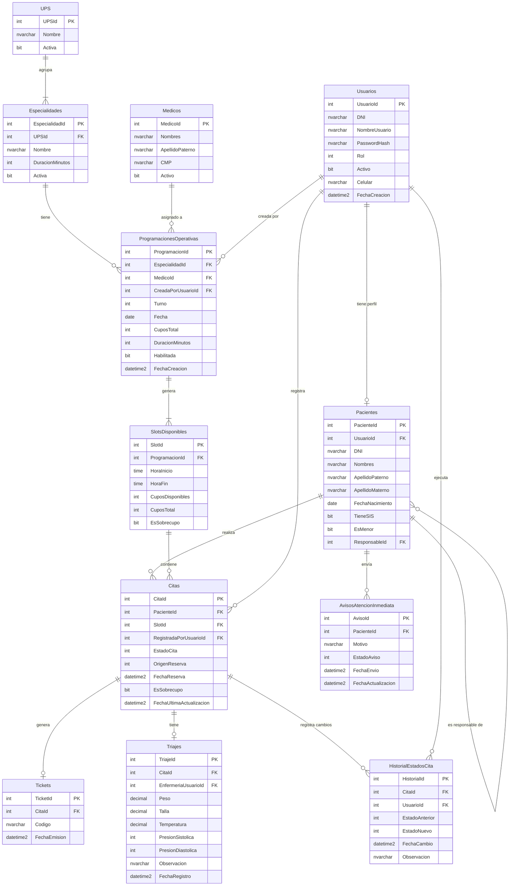

# BASE DE DATOS

Proyecto: Sistema Web de Gestión de Citas Médicas – Posta de Salud (PostaCitasWeb)  
Versión: 1.0  
Motor: SQL Server  
ORM: Entity Framework Core 10  
Estrategia de migración: Code-First con Migrations

---

## 1. PRINCIPIOS DE DISEÑO DE BASE DE DATOS

- Todas las tablas derivan directamente de las entidades documentadas en `04_modelo_dominio.md`. No existe ninguna tabla sin entidad correspondiente.
- Los enumerados (`Rol`, `Turno`, `EstadoCita`, `OrigenReserva`, `EstadoAviso`) se persisten como `int` en SQL Server, mapeados desde C# mediante EF Core.
- Los tipos `DateOnly` y `TimeOnly` de C# se mapean a `date` y `time` de SQL Server respectivamente.
- `DeleteBehavior.Restrict` en todas las claves foráneas críticas para evitar eliminaciones en cascada no controladas.
- Índices únicos explícitos en columnas que expresan restricciones de negocio (RN31, RN12, RN19).
- Ninguna lógica de negocio reside en la base de datos (sin stored procedures, sin triggers). Toda la lógica está en la capa `Services`.

---

## 2. TABLAS Y DEFINICIÓN DE COLUMNAS

### 2.1 Usuarios

Almacena credenciales y rol de todos los actores del sistema (RN01, RF01, RF02).

| Columna | Tipo SQL | Restricciones |
|---|---|---|
| `UsuarioId` | `INT` | PK, IDENTITY(1,1), NOT NULL |
| `DNI` | `NVARCHAR(8)` | NOT NULL, UNIQUE |
| `NombreUsuario` | `NVARCHAR(50)` | NOT NULL, UNIQUE |
| `PasswordHash` | `NVARCHAR(256)` | NOT NULL |
| `Rol` | `INT` | NOT NULL |
| `Activo` | `BIT` | NOT NULL, DEFAULT 0 |
| `Celular` | `NVARCHAR(15)` | NOT NULL |
| `FechaCreacion` | `DATETIME2` | NOT NULL, DEFAULT GETUTCDATE() |

**Notas:**
- `Activo DEFAULT 0`: ningún usuario puede acceder sin habilitación administrativa (RN01).
- `Rol` almacena el valor entero del enum: 0=Paciente, 1=Admision, 2=Enfermeria, 3=Administrador.

---

### 2.2 Pacientes

Datos personales del paciente. Separado de `Usuarios` para desacoplar identidad de autenticación (RF05, RN02, RN03).

| Columna | Tipo SQL | Restricciones |
|---|---|---|
| `PacienteId` | `INT` | PK, IDENTITY(1,1), NOT NULL |
| `UsuarioId` | `INT` | NOT NULL, UNIQUE, FK → Usuarios(UsuarioId) |
| `DNI` | `NVARCHAR(8)` | NOT NULL |
| `Nombres` | `NVARCHAR(100)` | NOT NULL |
| `ApellidoPaterno` | `NVARCHAR(50)` | NOT NULL |
| `ApellidoMaterno` | `NVARCHAR(50)` | NULL |
| `FechaNacimiento` | `DATE` | NOT NULL |
| `TieneSIS` | `BIT` | NOT NULL, DEFAULT 0 |
| `EsMenor` | `BIT` | NOT NULL, DEFAULT 0 |
| `ResponsableId` | `INT` | NULL, FK → Pacientes(PacienteId) |

**Notas:**
- `DNI`, `Nombres`, `FechaNacimiento`: no modificables por el paciente (RN02). Restricción aplicada en la capa de servicio.
- `ResponsableId` es auto-referencia: un paciente adulto puede ser responsable de N menores (RN03).
- `EsMenor` se calcula al momento del registro y puede actualizarse administrativamente.
- FK `ResponsableId` con `DeleteBehavior.Restrict` para evitar eliminación de responsable con dependientes activos.

---

### 2.3 UPS

Unidades Prestadoras de Servicios. Entidad interna, no visible para pacientes (RF13, RN07).

| Columna | Tipo SQL | Restricciones |
|---|---|---|
| `UPSId` | `INT` | PK, IDENTITY(1,1), NOT NULL |
| `Nombre` | `NVARCHAR(100)` | NOT NULL |
| `Activa` | `BIT` | NOT NULL, DEFAULT 1 |

---

### 2.4 Especialidades

Especialidades médicas visibles para pacientes. Pertenecen a una UPS (RF07, RF14, RN07, RN29).

| Columna | Tipo SQL | Restricciones |
|---|---|---|
| `EspecialidadId` | `INT` | PK, IDENTITY(1,1), NOT NULL |
| `UPSId` | `INT` | NOT NULL, FK → UPS(UPSId) |
| `Nombre` | `NVARCHAR(100)` | NOT NULL |
| `DuracionMinutos` | `INT` | NOT NULL, CHECK > 0 |
| `Activa` | `BIT` | NOT NULL, DEFAULT 1 |

**Notas:**
- `DuracionMinutos` determina la generación automática de slots (RN08, RN29).

---

### 2.5 Medicos

Personal médico registrado en el sistema. No tiene acceso de autenticación (RF15A, RN17).

| Columna | Tipo SQL | Restricciones |
|---|---|---|
| `MedicoId` | `INT` | PK, IDENTITY(1,1), NOT NULL |
| `Nombres` | `NVARCHAR(100)` | NOT NULL |
| `ApellidoPaterno` | `NVARCHAR(50)` | NOT NULL |
| `ApellidoMaterno` | `NVARCHAR(50)` | NULL |
| `CMP` | `NVARCHAR(20)` | NOT NULL, UNIQUE |
| `Activo` | `BIT` | NOT NULL, DEFAULT 1 |

---

### 2.6 ProgramacionesOperativas

Plantilla de jornadas configuradas por el Administrador. Admisión solo puede habilitarlas, no crearlas (RF15, RF15A, RN06, RN17).

| Columna | Tipo SQL | Restricciones |
|---|---|---|
| `ProgramacionId` | `INT` | PK, IDENTITY(1,1), NOT NULL |
| `EspecialidadId` | `INT` | NOT NULL, FK → Especialidades(EspecialidadId) |
| `MedicoId` | `INT` | NOT NULL, FK → Medicos(MedicoId) |
| `CreadaPorUsuarioId` | `INT` | NOT NULL, FK → Usuarios(UsuarioId) |
| `Turno` | `INT` | NOT NULL |
| `Fecha` | `DATE` | NOT NULL |
| `CuposTotal` | `INT` | NOT NULL, CHECK > 0 |
| `DuracionMinutos` | `INT` | NOT NULL, CHECK > 0 |
| `Habilitada` | `BIT` | NOT NULL, DEFAULT 0 |
| `FechaCreacion` | `DATETIME2` | NOT NULL, DEFAULT GETUTCDATE() |

**Notas:**
- `Turno`: 0=Mañana (08:00–13:30), 1=Tarde (15:00–19:00) (RN27, RN28).
- `Habilitada DEFAULT 0`: debe ser activada explícitamente por Admisión antes de la jornada (RN05, RN06).
- Índice compuesto `(EspecialidadId, MedicoId, Fecha, Turno)` recomendado para evitar duplicados de programación.

---

### 2.7 SlotsDisponibles

Cupos horarios individuales generados a partir de una programación. Unidad mínima de reserva (RF08, RN04, RN08, RN15, RN16).

| Columna | Tipo SQL | Restricciones |
|---|---|---|
| `SlotId` | `INT` | PK, IDENTITY(1,1), NOT NULL |
| `ProgramacionId` | `INT` | NOT NULL, FK → ProgramacionesOperativas(ProgramacionId) |
| `HoraInicio` | `TIME` | NOT NULL |
| `HoraFin` | `TIME` | NOT NULL |
| `CuposDisponibles` | `INT` | NOT NULL, CHECK >= 0 |
| `CuposTotal` | `INT` | NOT NULL, CHECK > 0 |
| `EsSobrecupo` | `BIT` | NOT NULL, DEFAULT 0 |

**Notas:**
- `CHECK (CuposDisponibles >= 0)`: garantiza a nivel de base de datos que los cupos no sean negativos (RN04).
- `EsSobrecupo = 1`: el slot es invisible para pacientes en consultas de disponibilidad (RN16).
- Los slots se generan desde `DisponibilidadService` en base a `HoraInicio` del turno + `DuracionMinutos` de la programación (RN08).

---

### 2.8 Citas

Entidad central. Registra cada reserva, ya sea web o presencial (RF09, RF10, RN04, RN11, RN31).

| Columna | Tipo SQL | Restricciones |
|---|---|---|
| `CitaId` | `INT` | PK, IDENTITY(1,1), NOT NULL |
| `PacienteId` | `INT` | NOT NULL, FK → Pacientes(PacienteId) |
| `SlotId` | `INT` | NOT NULL, FK → SlotsDisponibles(SlotId) |
| `RegistradaPorUsuarioId` | `INT` | NULL, FK → Usuarios(UsuarioId) |
| `EstadoCita` | `INT` | NOT NULL, DEFAULT 0 |
| `OrigenReserva` | `INT` | NOT NULL |
| `FechaReserva` | `DATETIME2` | NOT NULL, DEFAULT GETUTCDATE() |
| `EsSobrecupo` | `BIT` | NOT NULL, DEFAULT 0 |
| `FechaUltimaActualizacion` | `DATETIME2` | NOT NULL, DEFAULT GETUTCDATE() |

**Notas:**
- `EstadoCita`: 0=Pendiente, 1=EnTriaje, 2=ListoAtencion, 3=NoAsistio, 4=Cancelada (RN21).
- `OrigenReserva`: 0=Web, 1=Presencial (RN04).
- `RegistradaPorUsuarioId NULL`: solo se rellena cuando `OrigenReserva = Presencial` (registrada por Admisión).
- Índice único condicional para RN31 (ver sección de índices).

---

### 2.9 Tickets

Comprobante generado automáticamente al confirmar una cita. Relación 1:1 con `Citas` (RF12, RN12).

| Columna | Tipo SQL | Restricciones |
|---|---|---|
| `TicketId` | `INT` | PK, IDENTITY(1,1), NOT NULL |
| `CitaId` | `INT` | NOT NULL, UNIQUE, FK → Citas(CitaId) |
| `Codigo` | `NVARCHAR(20)` | NOT NULL, UNIQUE |
| `FechaEmision` | `DATETIME2` | NOT NULL, DEFAULT GETUTCDATE() |

**Notas:**
- `CitaId UNIQUE`: garantiza que ninguna cita tenga más de un ticket (RN12).
- `Codigo`: generado por la aplicación (ej. `TC-20250524-00042`). Único en toda la tabla.

---

### 2.10 Triajes

Evaluación clínica inicial registrada por Enfermería. Relación 1:1 con `Citas` (RF17, RN19, RN20, RN22).

| Columna | Tipo SQL | Restricciones |
|---|---|---|
| `TriajeId` | `INT` | PK, IDENTITY(1,1), NOT NULL |
| `CitaId` | `INT` | NOT NULL, UNIQUE, FK → Citas(CitaId) |
| `EnfermeriaUsuarioId` | `INT` | NOT NULL, FK → Usuarios(UsuarioId) |
| `Peso` | `DECIMAL(5,2)` | NOT NULL |
| `Talla` | `DECIMAL(5,2)` | NOT NULL |
| `Temperatura` | `DECIMAL(4,1)` | NOT NULL |
| `PresionSistolica` | `INT` | NOT NULL |
| `PresionDiastolica` | `INT` | NOT NULL |
| `Observacion` | `NVARCHAR(500)` | NULL |
| `FechaRegistro` | `DATETIME2` | NOT NULL, DEFAULT GETUTCDATE() |

**Notas:**
- `CitaId UNIQUE`: una cita tiene a lo sumo un registro de triaje (RN19).
- `EnfermeriaUsuarioId`: la validación de que sea `Rol = Enfermeria` se aplica en `TriajeService`, no en la base de datos (RN20).
- Datos operativos: no constituyen historia clínica (RN23, RN34).

---

### 2.11 HistorialEstadosCita

Registro inmutable de todos los cambios de estado de cada cita. Garantiza trazabilidad completa (RN30, RN32).

| Columna | Tipo SQL | Restricciones |
|---|---|---|
| `HistorialId` | `INT` | PK, IDENTITY(1,1), NOT NULL |
| `CitaId` | `INT` | NOT NULL, FK → Citas(CitaId) |
| `UsuarioId` | `INT` | NOT NULL, FK → Usuarios(UsuarioId) |
| `EstadoAnterior` | `INT` | NOT NULL |
| `EstadoNuevo` | `INT` | NOT NULL |
| `FechaCambio` | `DATETIME2` | NOT NULL, DEFAULT GETUTCDATE() |
| `Observacion` | `NVARCHAR(300)` | NULL |

**Notas:**
- Solo se insertan registros, nunca se actualizan ni eliminan (append-only).
- `UsuarioId`: registra quién ejecutó el cambio (paciente, enfermería, admisión o sistema).

---

### 2.12 AvisosAtencionInmediata

Avisos informativos enviados por pacientes a Enfermería. No generan citas ni alteran disponibilidad (RF20, RF21, RN24, RN25, RN26).

| Columna | Tipo SQL | Restricciones |
|---|---|---|
| `AvisoId` | `INT` | PK, IDENTITY(1,1), NOT NULL |
| `PacienteId` | `INT` | NOT NULL, FK → Pacientes(PacienteId) |
| `Motivo` | `NVARCHAR(300)` | NOT NULL |
| `EstadoAviso` | `INT` | NOT NULL, DEFAULT 0 |
| `FechaEnvio` | `DATETIME2` | NOT NULL, DEFAULT GETUTCDATE() |
| `FechaActualizacion` | `DATETIME2` | NULL |

**Notas:**
- `EstadoAviso`: 0=Pendiente, 1=Visualizado, 2=Cerrado (RF21).
- Solo visible para `Rol = Enfermeria` (RN26).

---

## 3. ÍNDICES

### Índices únicos (restricciones de integridad)

| Tabla | Columna(s) | Tipo | Justificación |
|---|---|---|---|
| `Usuarios` | `DNI` | UNIQUE | Un DNI pertenece a un solo usuario |
| `Usuarios` | `NombreUsuario` | UNIQUE | Credencial única de acceso |
| `Pacientes` | `UsuarioId` | UNIQUE | Relación 1:1 con Usuario |
| `Medicos` | `CMP` | UNIQUE | Código de colegiatura único |
| `Tickets` | `CitaId` | UNIQUE | 1:1 — una cita, un ticket (RN12) |
| `Tickets` | `Codigo` | UNIQUE | Código de comprobante irrepetible |
| `Triajes` | `CitaId` | UNIQUE | 1:1 — una cita, un triaje (RN19) |

### Índice único condicional — Anti-duplicado de reservas activas (RN31)

SQL Server no permite índices únicos filtrados directamente sobre múltiples estados con EF Core Fluent API, por lo que se aplica mediante migración manual:

```sql
CREATE UNIQUE INDEX UX_Citas_PacienteSlotActiva
ON Citas (PacienteId, SlotId)
WHERE EstadoCita IN (0, 1, 2);
-- 0=Pendiente, 1=EnTriaje, 2=ListoAtencion
```

Esto impide que un mismo paciente tenga más de una reserva activa para el mismo slot horario (RN31).

### Índices de rendimiento (consultas frecuentes)

| Tabla | Columna(s) | Justificación |
|---|---|---|
| `Citas` | `PacienteId` | Consulta de citas por paciente (RF19, CU15) |
| `Citas` | `SlotId` | Verificación de cupos al reservar (RN10) |
| `Citas` | `EstadoCita` | Filtrado por estado en panel de enfermería |
| `SlotsDisponibles` | `ProgramacionId` | Carga de slots por programación (RF08) |
| `SlotsDisponibles` | `EsSobrecupo` | Filtrado de sobrecupos para pacientes (RN16) |
| `ProgramacionesOperativas` | `(Fecha, Turno)` | Consulta de programaciones por jornada |
| `HistorialEstadosCita` | `CitaId` | Carga de historial por cita (RN30) |
| `AvisosAtencionInmediata` | `EstadoAviso` | Panel de avisos pendientes para enfermería (RF21) |

---

## 4. RELACIONES Y CLAVES FORÁNEAS

| Tabla hija | FK | Tabla padre | On Delete | On Update |
|---|---|---|---|---|
| `Pacientes` | `UsuarioId` | `Usuarios` | RESTRICT | NO ACTION |
| `Pacientes` | `ResponsableId` | `Pacientes` | RESTRICT | NO ACTION |
| `Especialidades` | `UPSId` | `UPS` | RESTRICT | NO ACTION |
| `ProgramacionesOperativas` | `EspecialidadId` | `Especialidades` | RESTRICT | NO ACTION |
| `ProgramacionesOperativas` | `MedicoId` | `Medicos` | RESTRICT | NO ACTION |
| `ProgramacionesOperativas` | `CreadaPorUsuarioId` | `Usuarios` | RESTRICT | NO ACTION |
| `SlotsDisponibles` | `ProgramacionId` | `ProgramacionesOperativas` | RESTRICT | NO ACTION |
| `Citas` | `PacienteId` | `Pacientes` | RESTRICT | NO ACTION |
| `Citas` | `SlotId` | `SlotsDisponibles` | RESTRICT | NO ACTION |
| `Citas` | `RegistradaPorUsuarioId` | `Usuarios` | RESTRICT | NO ACTION |
| `Tickets` | `CitaId` | `Citas` | RESTRICT | NO ACTION |
| `Triajes` | `CitaId` | `Citas` | RESTRICT | NO ACTION |
| `Triajes` | `EnfermeriaUsuarioId` | `Usuarios` | RESTRICT | NO ACTION |
| `HistorialEstadosCita` | `CitaId` | `Citas` | RESTRICT | NO ACTION |
| `HistorialEstadosCita` | `UsuarioId` | `Usuarios` | RESTRICT | NO ACTION |
| `AvisosAtencionInmediata` | `PacienteId` | `Pacientes` | RESTRICT | NO ACTION |

> Todas las claves foráneas usan `RESTRICT` para preservar integridad referencial. Las eliminaciones lógicas se manejan mediante columnas `Activo` o `EstadoCita = Cancelada`.

---

## 5. DIAGRAMA ENTIDAD-RELACIÓN (MERMAID)



---

## 6. CONFIGURACIONES FLUENT API (EF Core)

Cada entidad tiene su clase `IEntityTypeConfiguration<T>` en `Data/Configurations/`. A continuación, las configuraciones más relevantes derivadas de las reglas de negocio.

### CitaConfiguration.cs

```csharp
public class CitaConfiguration : IEntityTypeConfiguration<Cita>
{
    public void Configure(EntityTypeBuilder<Cita> builder)
    {
        builder.ToTable("Citas");
        builder.HasKey(c => c.CitaId);

        builder.Property(c => c.EstadoCita)
            .HasConversion<int>()
            .IsRequired();

        builder.Property(c => c.OrigenReserva)
            .HasConversion<int>()
            .IsRequired();

        builder.Property(c => c.FechaReserva)
            .HasDefaultValueSql("GETUTCDATE()");

        builder.Property(c => c.FechaUltimaActualizacion)
            .HasDefaultValueSql("GETUTCDATE()");

        // FK Paciente — RESTRICT
        builder.HasOne(c => c.Paciente)
            .WithMany(p => p.Citas)
            .HasForeignKey(c => c.PacienteId)
            .OnDelete(DeleteBehavior.Restrict);

        // FK Slot — RESTRICT
        builder.HasOne(c => c.Slot)
            .WithMany(s => s.Citas)
            .HasForeignKey(c => c.SlotId)
            .OnDelete(DeleteBehavior.Restrict);

        // FK Usuario registrador (nullable) — RESTRICT
        builder.HasOne(c => c.RegistradaPorUsuario)
            .WithMany()
            .HasForeignKey(c => c.RegistradaPorUsuarioId)
            .OnDelete(DeleteBehavior.Restrict)
            .IsRequired(false);

        // Índice de rendimiento
        builder.HasIndex(c => c.PacienteId);
        builder.HasIndex(c => c.SlotId);
        builder.HasIndex(c => c.EstadoCita);

        // Nota: el índice único condicional (RN31) se aplica
        // en migración manual (ver sección de índices)
    }
}
```

### SlotDisponibleConfiguration.cs

```csharp
public class SlotDisponibleConfiguration : IEntityTypeConfiguration<SlotDisponible>
{
    public void Configure(EntityTypeBuilder<SlotDisponible> builder)
    {
        builder.ToTable("SlotsDisponibles");
        builder.HasKey(s => s.SlotId);

        builder.Property(s => s.HoraInicio)
            .HasColumnType("time");

        builder.Property(s => s.HoraFin)
            .HasColumnType("time");

        // CuposDisponibles >= 0 a nivel de base de datos (RN04)
        builder.ToTable(t => t.HasCheckConstraint(
            "CK_Slots_CuposDisponibles",
            "[CuposDisponibles] >= 0"));

        builder.HasOne(s => s.Programacion)
            .WithMany(p => p.Slots)
            .HasForeignKey(s => s.ProgramacionId)
            .OnDelete(DeleteBehavior.Restrict);

        builder.HasIndex(s => s.ProgramacionId);
        builder.HasIndex(s => s.EsSobrecupo);
    }
}
```

### TicketConfiguration.cs

```csharp
public class TicketConfiguration : IEntityTypeConfiguration<Ticket>
{
    public void Configure(EntityTypeBuilder<Ticket> builder)
    {
        builder.ToTable("Tickets");
        builder.HasKey(t => t.TicketId);

        // 1:1 con Cita (RN12)
        builder.HasIndex(t => t.CitaId).IsUnique();
        builder.HasIndex(t => t.Codigo).IsUnique();

        builder.Property(t => t.Codigo)
            .HasMaxLength(20)
            .IsRequired();

        builder.HasOne(t => t.Cita)
            .WithOne(c => c.Ticket)
            .HasForeignKey<Ticket>(t => t.CitaId)
            .OnDelete(DeleteBehavior.Restrict);
    }
}
```

### PacienteConfiguration.cs

```csharp
public class PacienteConfiguration : IEntityTypeConfiguration<Paciente>
{
    public void Configure(EntityTypeBuilder<Paciente> builder)
    {
        builder.ToTable("Pacientes");
        builder.HasKey(p => p.PacienteId);

        // 1:1 con Usuario
        builder.HasIndex(p => p.UsuarioId).IsUnique();

        builder.Property(p => p.DNI).HasMaxLength(8).IsRequired();
        builder.Property(p => p.Nombres).HasMaxLength(100).IsRequired();
        builder.Property(p => p.ApellidoPaterno).HasMaxLength(50).IsRequired();
        builder.Property(p => p.FechaNacimiento).HasColumnType("date");

        // Relación con Usuario
        builder.HasOne(p => p.Usuario)
            .WithOne(u => u.Paciente)
            .HasForeignKey<Paciente>(p => p.UsuarioId)
            .OnDelete(DeleteBehavior.Restrict);

        // Auto-referencia Responsable → Dependientes (RN03)
        builder.HasOne(p => p.Responsable)
            .WithMany(p => p.Dependientes)
            .HasForeignKey(p => p.ResponsableId)
            .OnDelete(DeleteBehavior.Restrict)
            .IsRequired(false);
    }
}
```

---

## 7. MIGRACIÓN INICIAL

### Comando de creación

```bash
# Desde el directorio raíz del proyecto
dotnet ef migrations add InitialCreate --output-dir Data/Migrations
dotnet ef database update
```

### Migración manual para índice condicional (RN31)

Después de la migración inicial, agregar en el método `Up()` de la migración generada:

```csharp
// En Data/Migrations/XXXXXX_InitialCreate.cs — método Up()
migrationBuilder.Sql(@"
    CREATE UNIQUE INDEX UX_Citas_PacienteSlotActiva
    ON Citas (PacienteId, SlotId)
    WHERE EstadoCita IN (0, 1, 2);
");
```

Y en el método `Down()`:

```csharp
migrationBuilder.Sql("DROP INDEX IF EXISTS UX_Citas_PacienteSlotActiva ON Citas;");
```

---

## 8. CADENA DE CONEXIÓN (appsettings.json)

```json
{
  "ConnectionStrings": {
    "DefaultConnection": "Server=(localdb)\\mssqllocaldb;Database=PostaCitasWeb;Trusted_Connection=True;MultipleActiveResultSets=true"
  }
}
```

Para entorno de producción o servidor SQL Server dedicado:

```json
{
  "ConnectionStrings": {
    "DefaultConnection": "Server=NOMBRE_SERVIDOR;Database=PostaCitasWeb;User Id=sa;Password=TU_PASSWORD;TrustServerCertificate=True;"
  }
}
```

---

## 9. DATOS SEMILLA (Seed Data)

Los datos semilla se registran en `AppDbContext.OnModelCreating()` o en una migración dedicada `SeedData`. Son los mínimos necesarios para que el sistema funcione desde el inicio.

### Usuario Administrador inicial

```csharp
modelBuilder.Entity<Usuario>().HasData(new Usuario
{
    UsuarioId = 1,
    DNI        = "00000000",
    NombreUsuario = "admin",
    PasswordHash  = BCrypt.Net.BCrypt.HashPassword("Admin123!"),
    Rol        = Rol.Administrador,
    Activo     = true,
    Celular    = "000000000",
    FechaCreacion = new DateTime(2025, 1, 1, 0, 0, 0, DateTimeKind.Utc)
});
```

### UPS iniciales (ejemplo)

```csharp
modelBuilder.Entity<UPS>().HasData(
    new UPS { UPSId = 1, Nombre = "Medicina General", Activa = true },
    new UPS { UPSId = 2, Nombre = "Odontología",      Activa = true },
    new UPS { UPSId = 3, Nombre = "Obstetricia",      Activa = true }
);
```

### Especialidades iniciales (ejemplo)

```csharp
modelBuilder.Entity<Especialidad>().HasData(
    new Especialidad { EspecialidadId = 1, UPSId = 1, Nombre = "Medicina General", DuracionMinutos = 20, Activa = true },
    new Especialidad { EspecialidadId = 2, UPSId = 2, Nombre = "Odontología",      DuracionMinutos = 25, Activa = true },
    new Especialidad { EspecialidadId = 3, UPSId = 3, Nombre = "Obstetricia",      DuracionMinutos = 20, Activa = true }
);
```

---

## 10. REGLAS DE NEGOCIO REFLEJADAS EN LA BASE DE DATOS

| Regla | Mecanismo en BD |
|---|---|
| RN01 — Acceso controlado | `Usuarios.Activo DEFAULT 0` |
| RN04 — Stock compartido | `SlotsDisponibles.CuposDisponibles` decrementado por toda reserva independiente del origen |
| RN04 — Cupos no negativos | `CHECK (CuposDisponibles >= 0)` en `SlotsDisponibles` |
| RN12 — Ticket obligatorio | `Tickets.CitaId UNIQUE` + transacción en `CitaService` |
| RN15/RN16 — Sobrecupo oculto | Columna `EsSobrecupo BIT` filtrada en consultas de paciente |
| RN19 — Un triaje por cita | `Triajes.CitaId UNIQUE` |
| RN27/RN28 — Turnos y horarios | Enum `Turno` (0=Mañana, 1=Tarde) en `ProgramacionesOperativas` |
| RN30 — Trazabilidad | Tabla `HistorialEstadosCita` append-only |
| RN31 — Sin duplicados activos | Índice único condicional `UX_Citas_PacienteSlotActiva` |
| RN32 — Auditoría | `FechaCreacion` + `CreadaPorUsuarioId` en `ProgramacionesOperativas` |

---

*Documento generado en base a: 00_constitucion.md · 01_requisitos.md · 02_casos_uso.md · 03_reglas_negocio.md · 04_modelo_dominio.md · 05_arquitectura.md — Versión 1.0*